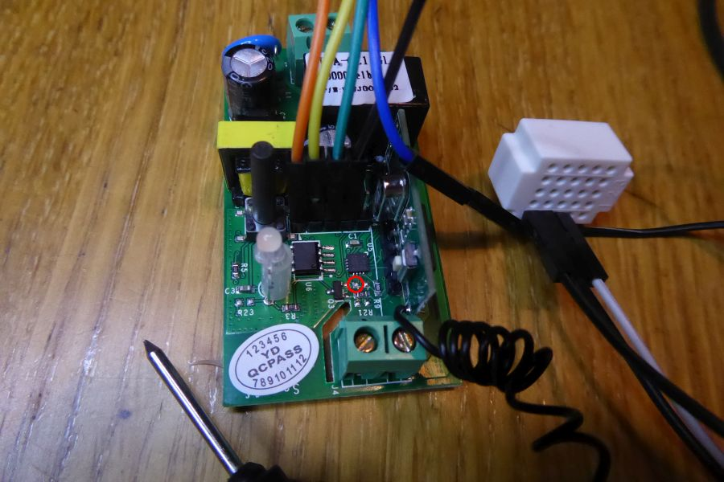
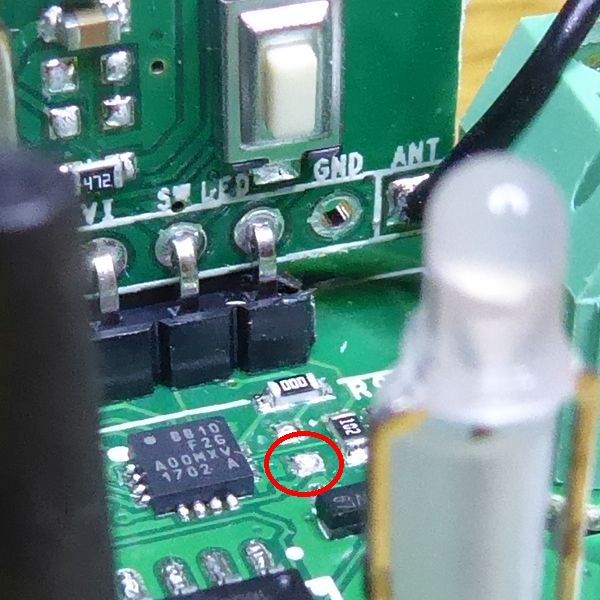
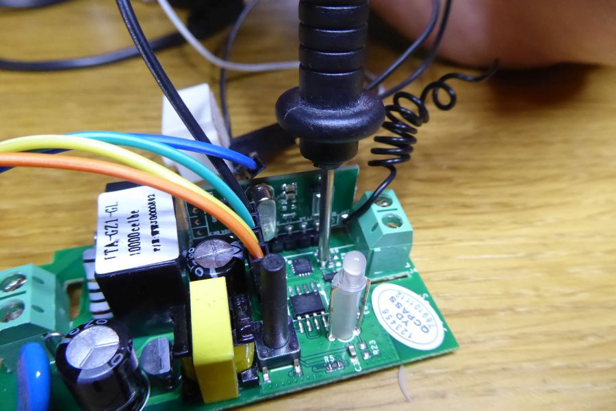

# Flashing Firmware

The selected firmware is: ESPEasy.

## Preparations

### ESPEasy Firmware

More info about install:
* https://www.letscontrolit.com/wiki/index.php/ESPEasy#Get_started
* https://www.letscontrolit.com/wiki/index.php/ESPEasy#Loading_firmware
* https://github.com/letscontrolit/ESPEasy

### USB to Serial Adapter

More info about USB-serial drivers:
* WeMos D1 mini has built-in CH341 USB-serial adapter, dirver: https://wiki.wemos.cc/downloads
* FT232 is a cheap USB-serial adapter, driver: https://www.ftdichip.com/Drivers/VCP.htm
* CP2102 is another cheap USB-serial adapter, driver: https://www.silabs.com/products/development-tools/software/usb-to-uart-bridge-vcp-drivers

## Flashing

### Simple Flashing Steps

Firmware flashing steps for ESPEasy firmware, using Windows:
1. Download and install USB-serial driver
1. Configure Windows driver options by Driver Manager, if needed (for example: 115200 baud)
1. Discover USB-serial COM port number by Driver Manager
1. Download and extract selected firmware zip
1. Run `flash.cmd`, set COM port, size, build num
1. After flashing, disconnect USB (power) cable

Example Flash Sizes:
* WeMos: 4096
* Sonoff: 1024

Before flashing Sonoff devices, the device must be started with GPIO0 grounded. In most cases, pressing the button, USB power on, waiting a few seconds is enough.

### Flashing Sonoff S20

Sonoff S20 was only able to flash by [NodeMCU Flasher](https://github.com/nodemcu/nodemcu-flasher) in `DOUT` SPI mode (maybe another flasher works also well). Advanced config:
* Baudrate: 115200
* Flash size: 1MByte
* Flash speed: 40MHz
* SPI Mode: DOUT 
See more details: [New Sonoff units need DOUT (not QIO) write mode when flashing](https://github.com/letscontrolit/ESPEasy/issues/474).

### Flashing Sonoff RF

It's not possible to set GPIO0 to 0 for flashing on Sonoff RF. Extra soldering or 4 hands are needed.

New Sonoff RF flashing:
* [Sonoff RF, Serial Flashing](https://github.com/arendst/Sonoff-Tasmota/wiki/Sonoff-RF#serial-flashing)

Legacy Sonoff RF flashing:
* [Hacking the SONOFF RF](https://piandmore.wordpress.com/2017/12/16/hacking-the-sonoff-rf/)
* [Xose Pérez, IteadStudio Sonoff RF](https://bitbucket.org/xoseperez/espurna-original/wiki/Hardware#markdown-header-iteadstudio-sonoff-rf)
* [Xose Pérez, Flashing](https://github.com/xoseperez/espurna/wiki/Hardware-Itead-Sonoff-RF#flashing)
* [Scargill's Tech Blog, Even More Sonoff](https://tech.scargill.net/even-more-sonoff/)

The simplest way for grounding GPIO0, if you have 4 hands, is continously grounding the missing R21 by hands before and during flasing, see:
1. Sharing the ground by a small breadboard: 
1. Location of missing R21: 
1. Grounding GPIO0 before USB power and during flashing (4 hands are needed): 
